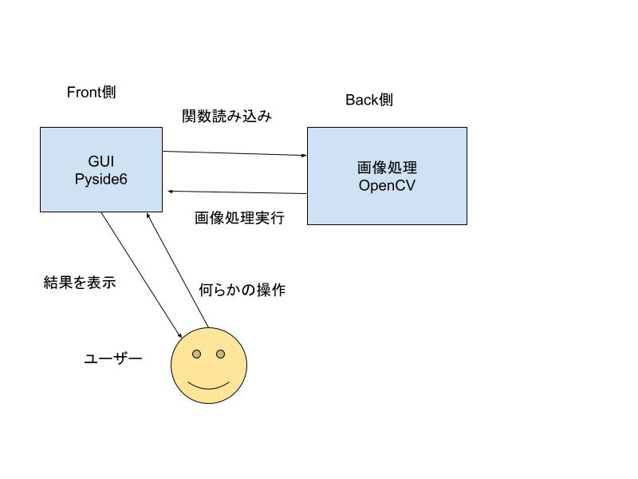

# はじめに

#### ※VScode上で、`［Shift］＋［Command］＋［V］` を押してもらえれば.mdファイルをプレビュー表示できます。そちらを使用して閲覧してください。
 
今回のプロジェクトの取り組み方についてこのREADMEで解説しています。

 
 

# 目次

- [コーディングルールについて](#coding-rules)
- [開発構成の概要](#system-configuration)
- [構成図](#architecture-diagram)
- [使用技術](#technology-used)
- [環境構築の手順](#setup-guide)
- [ディレクトリ構造](#directory-structure)
- [分担早見表](#component-responsibilities)
- [GitとGitHubの運用方法](#git-github-workflow)
- [Discordの運用方法](#discord-workflow)

 
 
 <h1 id="coding-rules">コーディングルールについて</h1>

前回と同様です。

- 命名規則
    - 作成する変数名はローワーキャメルケースで書く
    - 作成するクラス名はアッパーキャメルケースでかく
- 関数にはアノテーション（型ヒント）を入れる
    - 特に画像処理用に作成する関数はGUI側の人たちが扱うのでアノテーションは入れるよう心がけてください。

また、フォルダやプログラムファイルを追加・削除する場合は事後で良いのでにリーダーまで口頭かDiscordで連絡をお願いします。（Discordに専用のチャンネルがあります）

 
 
 <h1 id="system-configuration">開発構成の概要</h1>

詳しくは[こちら](https://docs.google.com/document/d/16XAETaR2dVS1v5T28FCdTokvZ4U-kG5_T_XCnupWvAY/edit#heading=h.1ttfgws1trn2)にあります。
第12回のときに作成したアプリ案を読んでもらえれば大丈夫です。

 
 
 <h1 id="architecture-diagram">構成図</h1>

大体こんなイメージです

 
 
 <h1 id="technology-used">使用技術</h1>

主にPythonのライブラリとしてOpenCVとPyside6を使います。
使用するpythonのライブラリに関してはディレクトリ直下のrequirements.txtに書き出してあります。  
`pip install -r requirements.txt` で一括インストールできます。

 
 
 <h1 id="directory-structure">ディレクトリ構造</h1>
 
 **Googleドキュメントのアプリ案の方にも同じ内容が載っています。**
 
 今回はこのような感じで行きます。
 editフォルダとsavedフォルダはGitの監視対象から外したので、そこに画像を入れてもGitHub側に変更が反映されないようになっています。

## main.py
- GUIの起動をするためのファイル
- 最後に書く

## GUI
- トップページと編集ページの2ウィンドウ構成
- 基本方針として部品ごとに作成していく、最終的に部品をグリッドで配置するイメージ
- 部品の段階でイベントリスナーを入れるかは要相談
- 参考資料: 【PySide6】ウィジェットをクラス化したら全く反応しなくなったときの対処法

- ### topPage.py
	- トップページのレイアウトを配置する

- ### editPage.py
	- 編集ページのレイアウトを配置する

- ### windowManager.py
	- 2つのページを組み合わせGUIアプリをコントロールする。

- ### components
	- 部品を格納するフォルダ
	- 作りたい部品一覧

- ### windowFuncList.py
	- イベントリスナー用の関数を書いておくファイル

## img
- 画像を入れるフォルダ

- ### edit
	- 編集中の画像を保存しておくフォルダ
	- 基本的に常に一枚の画像が格納されている状態

- ### saved
	- 画像一覧で表示する画像を格納しておくフォルダ

## module
- 画像処理用の関数が格納されている

- ### 学籍番号.py
	- それぞれが担当している部分の関数をここで作成する
	- 詳しくはsample.pyを参考にすること

- ### postProcessing.py
	- 画像処理関数を作るにあたっての親クラスがここにある

- ### ppManager.py
	- 個々が作った関数をまとめるファイル
	- ここを参照すれば関数が全て使えるようにする

## data
- 画像処理などで使う外部ファイルを格納するためのフォルダ

 

 
 
 <h1 id="component-responsibilities">プロジェクトの作業分担早見表</h1>
 
  **こちらもアプリ案の方に同じ内容が載っています。**

| 名前   | 作業担当 | 作業内容 |
| ------ | -------- | -------- |
| k22006 | GUI（サブリーダー） | GUI制作の補助、main.pyの作成 |
| k22008 | GUI | トップページのレイアウト |
| k22025 | 画像処理 | 顔・物体検出してそれだけ色変える、顔・物体検出して切り抜き |
| k22052 | GUI | 画像処理以外の必要な処理の実装、アップロード処理、ダウンロード処理、ページの遷移処理、編集ページのレイアウトの補助 |
| k22068 | GUI | 編集ページのレイアウト |
| k22136 | 画像処理 | 縦横比変更、色変換 |
| k20114 | 画像処理 | 白黒画像にする、画像のトリミング |
| x22037 | 画像処理（サブリーダー） | 物消す、画像処理担当全体の補助 |

 
 
<h1 id="git-github-workflow">GitとGitHubの運用方法</h1>

基本的に前回と同様です。
第12回のときに少し話したReviewのやり方について追記してます。

### 概要
このガイドでは、プロジェクトでのGitおよびGitHubの基本的な運用方法について説明します。チームメンバーは、以下のルールに従って作業を進めてください。

### ブランチ戦略
- **メインブランチには直接触れないでください。** メインブランチは安定したコードのみを含むべきで、直接の変更は行いません。
- ブランチの作成は[アプリ案](https://docs.google.com/document/d/16XAETaR2dVS1v5T28FCdTokvZ4U-kG5_T_XCnupWvAY/edit)に記載されているやり方で作成してください。

### コミットのガイドライン
- コミット時には、以下のプレフィックスをタイトルに付けてください。これにより、コミットの目的が明確になります。
  - `init:` 初期設定関連
  - `feat:` 新しい機能の追加
  - `fix:` バグの修正
  - `docs:` ドキュメントのみの変更
  - `style:` コードの意味に影響を与えない変更（空白、書式設定、セミコロンの追加など）
  - `refactor:` バグの修正も機能の追加も行わないコード変更
  - `perf:` パフォーマンスを向上させるコード変更

### プルリクエスト（PR）の運用
- 機能の追加やバグの修正が完了したら、プルリクエストを作成してください。
- プルリクエストは、変更内容が他のチームメンバーによってレビューされ、承認されることを目的としています。
- プルリクエストのタイトルは、抽象的に書かず変更の内容を正確に反映させるようにしてください。
	- #### ※プロジェクトフォルダ内にPRテンプレートを作成しておいたのでそちらをコピペして使用してください。

### Reviewのやり方
- Discordにプルリクエスト報告が上がったらレビューをやって欲しいです。
- GitHubDesktop上でブランチを切り替えて動作を確認してください。
- 動作の確認が終わったらReviewテンプレートを使用してGitHub上のプルリクエストにコメントを追加してください。
- 最後にDiscord上で送られたプルリクエスト報告にリアクションとレビューを行った旨をコメントしてください。

### issueの活用
- GitHubには**issue**というものがあります。これは自分では解決できない、エラー・バグに遭遇した時や、新しい機能の追加を提案したい時に、他の人に協力をお願いする / リーダーに承認をもらう ためのものです。
	- 今回では、「時間が余ったので、他の画像処理も実装したい」、「〇〇機能の実装が難しいので△△機能の実装に切り替えたい」、など
- issueを作成するには**メニュー バーでRepositoryを選択し、Create issue on GitHub**をクリックします。
- issueのタイトルも同様に、抽象的に書かず変更の内容を正確に反映させるようにしてください。
	- #### ※issueテンプレートを作成しておいたのでそちらを使用してください。
- プログラミングで詰まった時には、こちらを使用してアドバイスをもらってください。また、やり方が分からない場合はリーダーまで連絡をお願いします。

### マージのポリシー
- マージはプロジェクトリーダーが行います。レビューが完了し、承認されたプルリクエストは、リーダーがマージします。
 
 

<h1 id="discord-workflow">Discordの運用方法</h1>

こちらも前回とほとんど変更はないです。GitHub関連のチャンネルが少し変わっています。

## 概要
今回Discordは主に連絡と情報共有の為に使用していきます。
LINEだと情報がカテゴリー分けできないのでこちらを採用しました。
チーム開発をするにあたってこんな感じで使いたいというイメージ
- **バグが発生した / よく分からないエラーが出る**　-->　issueを作成して報告又は#相談 に投稿
- **ある程度処理がまとまって実装できた**　-->　プルリクエストを作成
- **どうしても〇〇の処理が実装できない**　-->　#相談 に投稿
 
以下にそれぞれのチャンネルの使い方を記載しておきます。

---
### はじめに
- ここに上記の概要っぽいことが書いてあります。 
### チームアナウンス
- リーダーからの連絡はここから送るつもりです。
- 誰が読んだか知りたいので読んだら必ずリアクションをお願いします。
- 基本メンションする予定ですが、念の為通知をオンしておいてください。
### member
- ここは気にしなくて大丈夫です。
- 入ってきたメンバーが表示されます。
### issue報告
- ここで作成したissueの報告をしてもらいます。
- タイトルに作成したissueのタイトルをコピペして投稿してください。
- 本文は何か伝えておきたいことがなければ無くて大丈夫です。（GitHubの方で書いてもらう為）
### プルリクエスト報告
- こちらも運用方法はissue報告と同様です。
- ここで作成したプルリクエストの報告をしてもらいます。
- タイトルに作成したプルリクエストのタイトルをコピペして投稿してください。
- 本文は何か伝えておきたいことがなければ無くて大丈夫です。（GitHubの方で書いてもらう為）
### ファイル・フォルダ追加報告
- ファイル・フォルダを追加したらこちらで報告お願いします。
### ブランチ作成報告
- 初回以降でブランチを作成する場合はこちらで報告お願いします。
### 相談
- 少しissueと運用方法が似ていますが、何か困ったことがあったらこちらを利用してください。
- イメージとしては〇〇の処理を実装したい時に参考になるサイトを教えて欲しい時などに使用してください。
### 雑談
- その名の通りです。
- 特にルールはないです。
### 参考文献
- プロジェクトを進める上で何か参考になりそうなサイトがあったらこちらで共有してくれると助かります。

## 最後に
こんだけチャンネルの説明をしましたが、GitHub関連以外のチャンネルは無理して利用しなくて大丈夫です。
ただ、分からなくて何もしなかった / 出来なかったよりかは誰かに聞いた方が良いので、分からなくて少しでもコーディングに詰まったら誰かに聞きましょう。
discord上で聞いて答えが返ってこなかったらそれはチームの責任なので、自分が分かることは積極的に教えてあげてください。
 